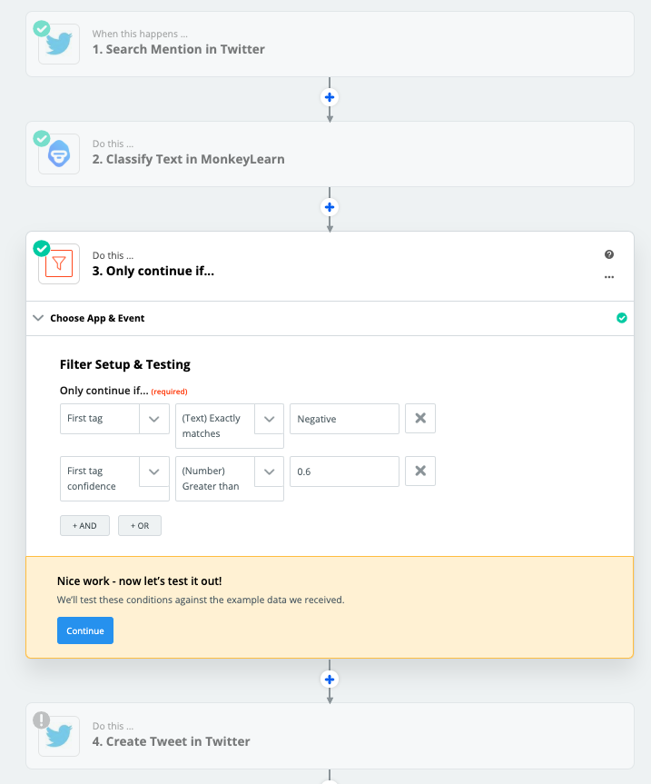

# Bot Workshop

## Intro (Tag 1)
- APIs 
- Developer Tools im Browser
- JSON Format
- Test mit OpenWeathermap API (-> siehe code)
- Einfache Zapier & Twitter Demo

## Twitter Reply Bot (Tag 2)
1) Accounts erstellen bei:
    - zapier.com
    - twitter.com

    Falls ihr wollt: mit [https://temp-mail.org/de/](https://temp-mail.org/de/)

2) Einen Tweet mit dem Hashtag #machines4future posten!

3) Zap erstellen, der auf Posts mit dem Hashtag #machines4future reagiert

4) Einen Account bei [Monkeylearn](https://monkeylearn.com) erszellen und mit Zapier verbinden.

5) Sentiment analysieren und die Antwort nur ausführen, wenn der gefundene Tweet positiv oder negativ ist. Und natürlich inhaltlich auf die Stimmungslage eingehen (z.B. mit GIFs und Videos)!

